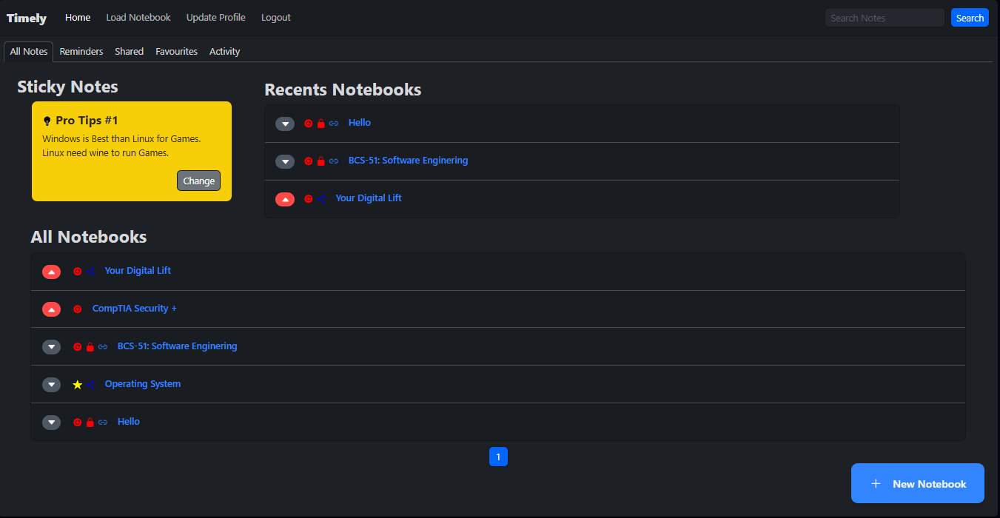

# Timely: Notebook Web App 📝

Timely is a simple and efficient note-taking web app built with Django.  
It allows users to create, edit, and organize notes effectively.

Running at (for now): [Timely](http://timely.pythonanywhere.com/)

## Features
✅ Create and edit notes  
✅ Organize notes into notebooks  
✅ Set reminders  
✅ Simple and intuitive UI  
✅ and many more coming in updates 

## Installation
1. Clone the repository:
   ```bash
   git clone https://github.com/Ketan-coder/NoteTakingApp.git
    ```

2. Navigate to the project directory:
   ```bash
   cd NoteTakingApp/Timely
    ```

3. Install dependencies:
   ```bash
   pip install -r requirements.txt
    ```

4. Run migrations:
   ```bash
   python manage.py makemigrations
   python manage.py migrate
    ```

5. Run the development server:
   ```bash
   python manage.py runserver
    ```

---

### **2️⃣ Running with Docker 🐳**
If you want to run this project using **Docker**, follow these steps:

1. **Ensure Docker is installed** on your system. If not, install it from [Docker's official website](https://docs.docker.com/get-docker/).

2. **Clone the repository (if not already done):**
   ```bash
   git clone https://github.com/Ketan-coder/NoteTakingApp.git
   cd NoteTakingApp/Timely
   ```

3. **Build the Docker image:**
   ```bash
   docker build -t timely-app .
   ```

3. **Build the Docker Container (Optional):**
   ```bash
   docker-compose up --build
   ```

4. **Run the container:**
   ```bash
   docker run -p 8000:8000 timely-app
   ```

5. **Access the app** in your browser:
   ```
   http://localhost:8000
   ```